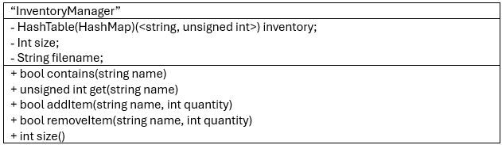
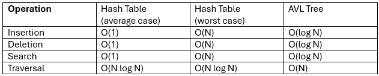

# 1: Introduction

My design is a player inventory for a video game. For each item in the inventory, information must be stored on its name and the quantity of the item in the inventory. It will be built atop a ``HashTable<string, unsigned int>.``

# 2: Design Philosophy

The client of this inventory system would be a hypothetical game company developing a winter survival game. The user would be the players of the mentioned game. The multiset would be used to track the inventory of the player as well as any other inventories in the game. They want something relatively simple and efficient, as there is concern over a large number of inventory items causing excessive lag. They want it to be easily modified in the future, as features such as weight tracking are expected to be implemented at a later date.

The game being developed has save states, and as such the player inventory system must have a way to save and load inventory data from memory, otherwise it will not be useable for its intended purpose. 

# 3: Core Operations

### bool contains(string name)
* **Purpose:** Checks if a given string is associated with a value in the multiset. Allows the game to check if the player has an item, for example if a player attempts to open a door, the game may check first to see if the player’s inventory contains a key to the door. Returns true if the name is in the multiset, and false otherwise. 
* **Possible Edge Cases:** In theory this method shouldn’t need much handling of edge cases since if the name is not found, the method will simply return false. 
* **Time Complexity:** should typically be O(1), O(n) in worst case
* **How the data structure supports/constrains this operation:** HashTables have a generally better search time complexity than AVLTrees and sequences, meaning hashtables support this operation.

### unsigned int get(string name)
* **Purpose:** get returns the quantity associated with a given item. Allows you to check how much of an item the player inventory has when you only have the name of the item. 
* **Possible Edge Cases:** Because it is possible that a name will be given which is not contained in the multiset, the method must be able to handle not being able to give a proper return value, likely via ‘std::optional.’
* **Time Complexity:** Should be O(1)
* **How the data structure supports/constrains this operation:** As stated before, HashTables have a generally better search time complexity than AVLTrees and sequences, meaning hashtables support this operation. 

### bool addItem(string name, int quantity)
* **Purpose:** Adds an item to the inventory. Needed to populate the inventory. Used by the game whenever a player picks up an item. Int quantity will default to 1. Returns false if an item could not be added. 
* **Possible Edge Cases:**  someone attempting to add a negative quantity of items will likely be problematic, so to deal with this the input will not be accepted unless it is positive. 
* **Time Complexity:** should typically be O(1), O(n) in worst case
* **How the data structure supports/constrains this operation:** Hashtables have a generally better time complexity than AVLTrees and sequences for simple insertion. Resizing the hashtable will need to happen occaisonally, however in this case occasional momentary dips in performance are acceptable. 


### bool removeItem(string name, int quantity)
* **Purpose:** Removes a designated number of a specified item from the inventory. If no quantity is given, it will remove all of that item from the inventory. Used by the game whenever the player drops an item or triggers any other event that could cause inventory items to be removed or consumed in the future.
* **Possible Edge Cases:** Someone could attempt to remove a negative amount of items, likely resulting in gameplay errors later down the line. An additional potential edge case is someone attempting to remove more of an item than currently exists. In both cases, the method will simply return false before removing the item to prevent potential issues. 
* **Time Complexity:** should typically be O(1), O(n) in worst case.
* **How the data structure supports/constrains this operation:** Hashtables have a generally better time complexity than AVLTrees and Sequences for simple removal. Resizing the hashtable will need to happen occaisonally, however in this case occasional momentary dips in performance are acceptable. 

### HashTable<string, unsigned int> search(string searchTerm)
* **Purpose:** gets a list of all items in the inventory, and returns the ones which contain the string searchTerm. This will be used in the final game to provide search functionality in the inventory to make it easier to find specific items within it.
* **Possible Edge Cases:** in theory if improper input is provided the only thing that should go wrong is no items being found in the search. 
* **Time Complexity:** O(N log N) since traversing the table to check every item will be needed. 
* **How the data structure supports/constrains this operation:** this operation would likely be more efficient if implemented within another data structure due to HashTables having a poor time complexity for traversal. 

# 4: Set Operations

## union_with()
* **Purpose:** union_with() is a set operation which will be used to quickly combine two different inventories. This will be implanted so that later on the developers can add a button which instantly transfers all items in a different inventory to the player’s inventory. 

* **Possible edge cases:** If there is an item that is in both inventories, the value of the item in both inventories must be added together to ensure the new inventory is accurate. 

* **Time Complexity:** should be O(n + m) where n and m are the number of elements in each inventory. 

* **How the data structure supports/constrains this operation:** Hashtable has an insert which are on average faster than insertion in sequences and AVL trees, though in this case performance gain is less great due to the operation likely causing at least 1 resize in the new multiset.

## intersection_with()
* **Purpose:** Intersection_with() is a set operation which will be used to allow the player to quickly take items from another inventory if they already have that item in their inventory. This allows common items like arrows to be quickly added to the players inventory. 

* **Possible edge cases:** As long as logic for adding items is implemented properly there should be no issues. 

* **Time Complexity:** should be O(n + m) where n and m are the number of elements in each inventory. 

* **How the data structure supports/constrains this operation:** Hashtable has an insert which are on average faster than insertion in sequences and AVL trees, though in this case performance may actually be worse due to the operation likely causing collisions or even a resize in the new multiset. 

# 5: Extension Feature

## serialize() / deserialize()

Two methods would be needed, one to load or "deserialize" the multiset and one to load or "serialize" it. This would be used by the game to load the contents of a players inventory when loading a save, as well as other inventories throughout the world. This will be needed for save states to be added to the game. 

**serialize()** will use ofstream to output the inventory data to a file. The syntax to accomplish this without causing errors is roughly:
```
ofstream writeFile(filename);
if (writeFile.is_open()) {
    for (item : inventory) {
        writeFile << item_name << "," << item_quantity << endl;
    }
    writeFile.close();
}

# This is pseudocode and is likely somewhat innacurate
```
The syntax I used in this pseudo code was designed using information from the cppreference.com page std::basic_ofstream (n.d.). 

**deserialize()** will share somewhat similar syntax, but will use the ifstream class instead for file reading. The main difference will be that the getline() (std::basic_ifstream, n.d.). This can be acheived via:

```while (std::getline(readFile, string line))...```

# 6: UML Diagram



The core attributes of the class are private to stop them from being modified outside of the class, which may cause unforeseen errors. All of the currently planned methods are public as they all will need to be used by methods outside of the inventory manager. 

# 7: Trade-off Analysis

The major disadvantage of hash tables is that while they are on average very fast, collisions occur somewhat often and cause the time complexity to worsen (Lázaro, Jesús et al., 2021). AVL Trees in comparison are on average worse in a time complexity sense, however AVL Trees are significantly more consistent, making them preferred for some operations. For an easier comparison, the time complexities of both are listed below.



In this case overall performance is valued more highly than the consistency provided by AVL Trees, as the primary times the performance would be a concern is when the player is adding items to the inventory, which is preferable to worsened performance within general gameplay. 

# 8. Alternative Design Outline

If the developers needed a system with a greater traversal speed an AVL tree may have been more adequate than a hash table. In this case the developers prefer to have a greater average time complexity for the inventory rather than the AVL tree's more consistent time complexity and faster traversal. In this case, the methods would need somewhat different design to account for the fundamentally different data structures, however the same methods would likely be used.

# 9. Evaluation Plan

If a custom designed hash table is being used then it should have thorough tests for all of its methods ensuring that the hash table deals with data as intended in all cases. Once that is tested the thing I would be most concerned about testing is whether or not the methods for removal and insertion are capable of accurately changing the quantity of inventory items. Test cases will also be included for other methods to ensure they always give the expected output. 

This would allow future developers which will need to modify this code later on the verify the code works properly and as intended. At some point it would likely be beneficial to time the class in its speed to determine if it is meeting reasonable performance metrics. 

I will know the code is extendible and maintainable when all methods have reasonably explanatory comments, effective use of blank space, and clear readable code. 


# 10. Conclusion
This design is effective because it relies on the very good time complexity hash tables have in insertion, deletion, and search. The biggest weakness of the design is the somewhat poor traversal time of hash tables, heavily increasing the number of resources that are used whenever an operation requires traversing every inventory item. If I were to add more features to this inventory manager to make it more complete I would add a system for tracking the current weight of the inventory via weight tracking for each item, as well as add methods to sort the inventory into a properly sorted list. 

My design demonstrates understanding of all of the core object-oriented principles. It demonstrates abstraction by ensuring that all manipulation of the inventory is done through public methods and not direct manipulation of the data, since all of the attributes are private. It also demonstrates encapsulation due to the bundling of the functionality of the hash table class and the individual inventory manager operations into a set of simple public classes. The code also supports composition due to the separated classes dealing with hash table logic and the actual inventory operations

# References


cppreference. (n.d.). Std::basic_ofstream. cppreference.com. https://en.cppreference.com/w/cpp/io/basic_ofstream.html 

cppreference. (n.d.). Std::basic_ifstream. cppreference.com. https://en.cppreference.com/w/cpp/io/basic_ofstream.html 


Lázaro, Jesús et al. “Fast and Efficient Address Search in System-on-a-Programmable-Chip Using Binary Trees.” Computers & electrical engineering 96 (2021): n. pag. Web.
